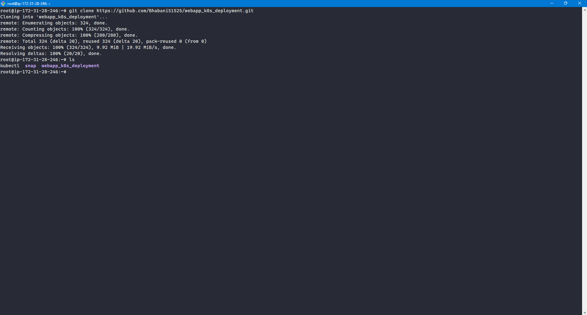
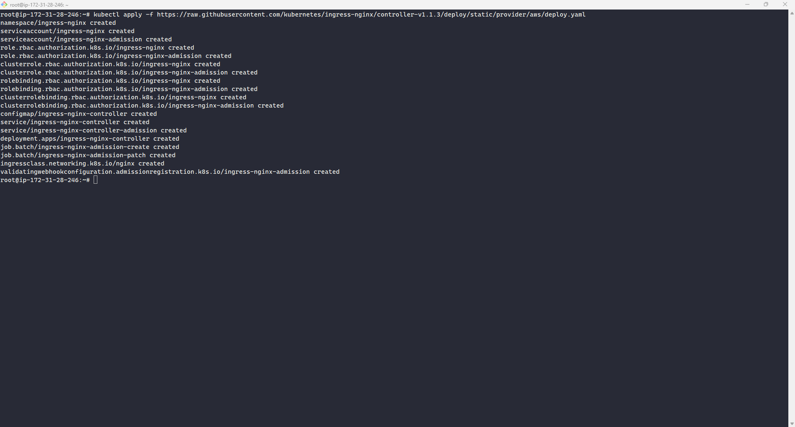
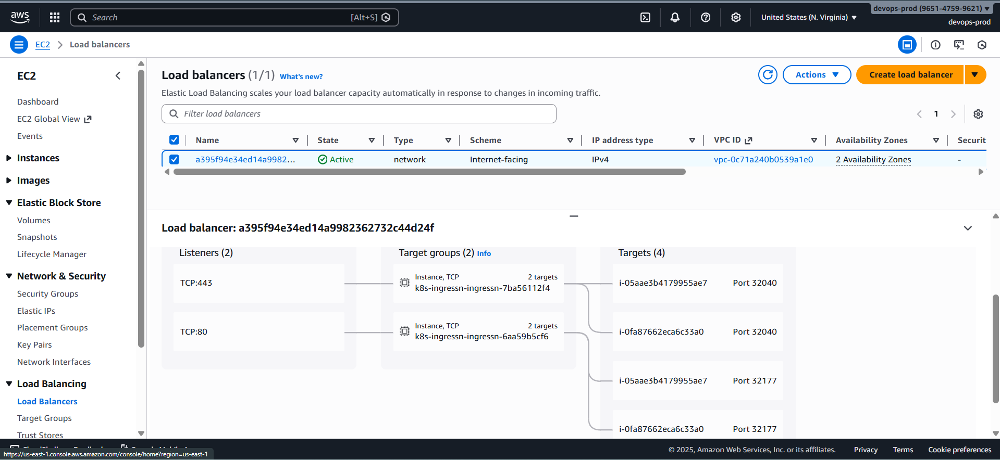
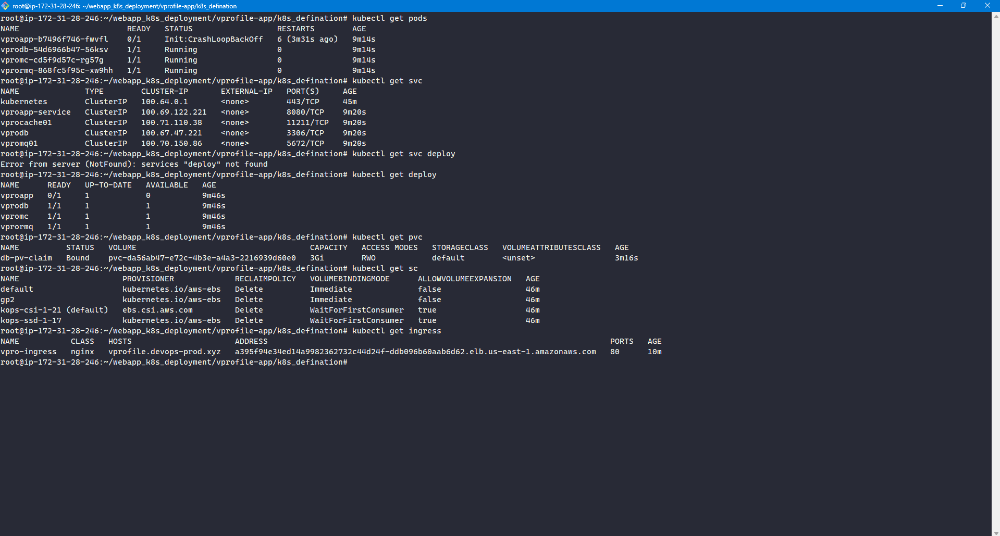
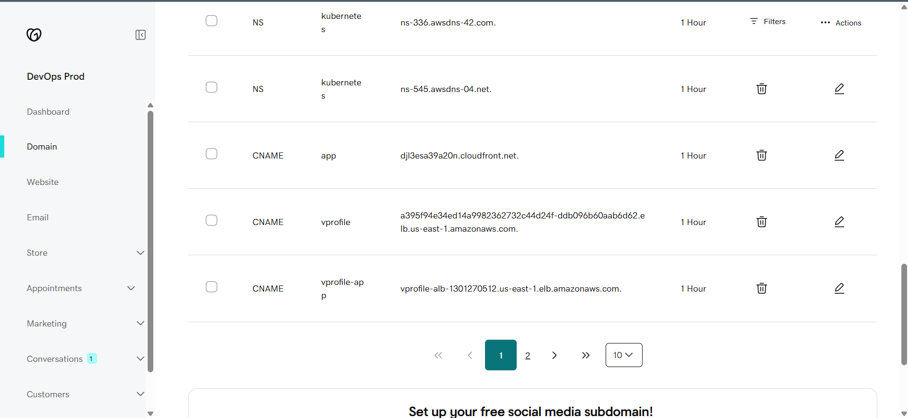

# ⚙️ Cluster & Source Code Setup

This section covers preparing the Kubernetes cluster, deploying the Ingress Controller, and creating all Kubernetes resources for the VProfile application.

### 🧱 1️⃣ Kubernetes Cluster Setup

Follow the guide below to provision the Kubernetes cluster on AWS using KOps:

👉 **[Kubernetes Cluster Setup Using KOps](../k8s_cluster_setup/KOps_setup.md)**

### 📥 2️⃣ Pull Source Code to Bootstrap EC2 Instance

Once the cluster is ready:

- SSH into the EC2 instance used to manage the cluster
- Switch to the root user
- Clone the application source code into the root user’s home directory

```bash
sudo -i
git clone <repository-url>
cd <repository-name>
```



### 🌐 3️⃣ Deploy NGINX Ingress Controller

Before deploying application manifests, an Ingress Controller must be installed to provision an AWS Load Balancer.

Run the following command:

```bash
kubectl apply -f https://raw.githubusercontent.com/kubernetes/ingress-nginx/controller-v1.1.3/deploy/static/provider/aws/deploy.yaml
```

This creates the **`ingress-nginx`** namespace and deploys the required controller pods.



#### Verify Installation

```bash
kubectl get ns
kubectl get pods -n ingress-nginx
```

Wait until all Ingress pods are in the **Running** state.




### 🚀 4️⃣ Deploy Kubernetes Objects

Once the cluster, nodes, and load balancer are provisioned, create all Kubernetes resources using the application manifests by navigating to the kubernetes defination dirctory.

```bash
kubectl create -f .
```


### 🔍 5️⃣ Verify Resources

Check the status of all Kubernetes components:

```bash
kubectl get pods
kubectl get svc
kubectl get deploy
kubectl get pvc
kubectl get sc
kubectl get ingress
```



Ensure all resources are created successfully and running as expected.

### 🌍 6️⃣ Domain Mapping

- Copy the external Load Balancer DNS name created by the Ingress Controller
- Create a **CNAME record** in GoDaddy (or your domain registrar)
- Map the application domain to the Load Balancer endpoint
- 

> At this stage, the VProfile application should be fully accessible through the configured domain using the Kubernetes Ingress.
