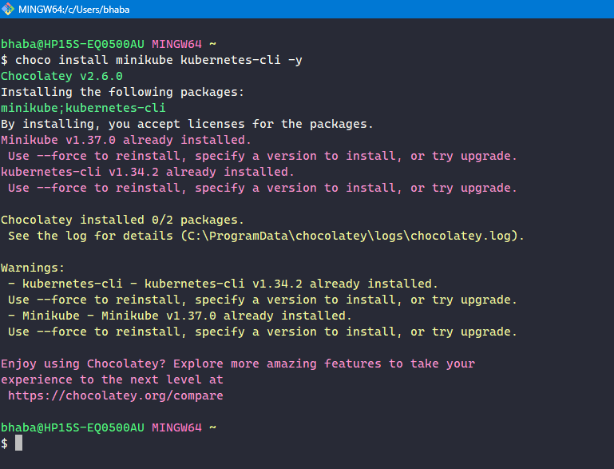
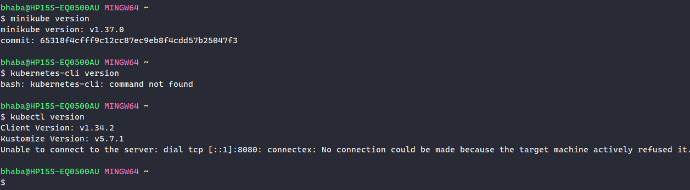
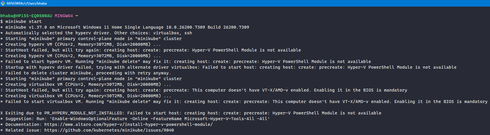
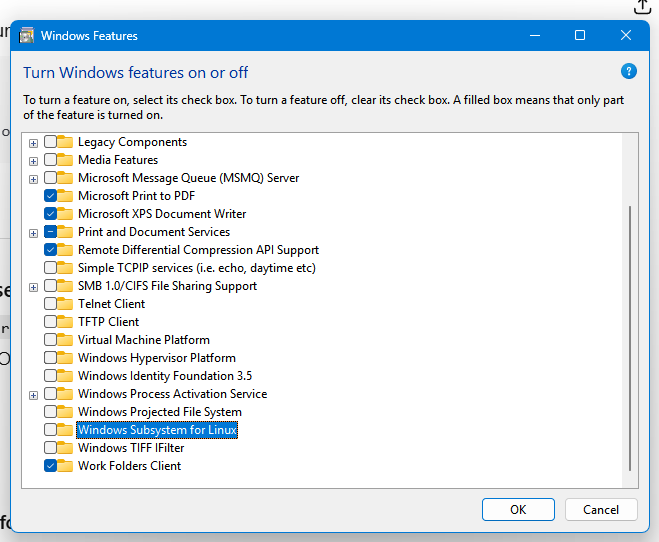
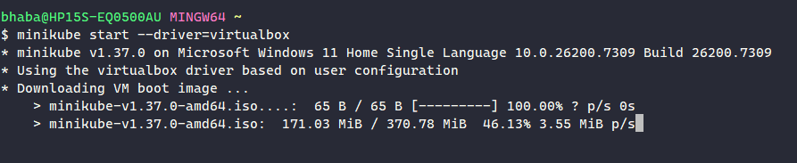
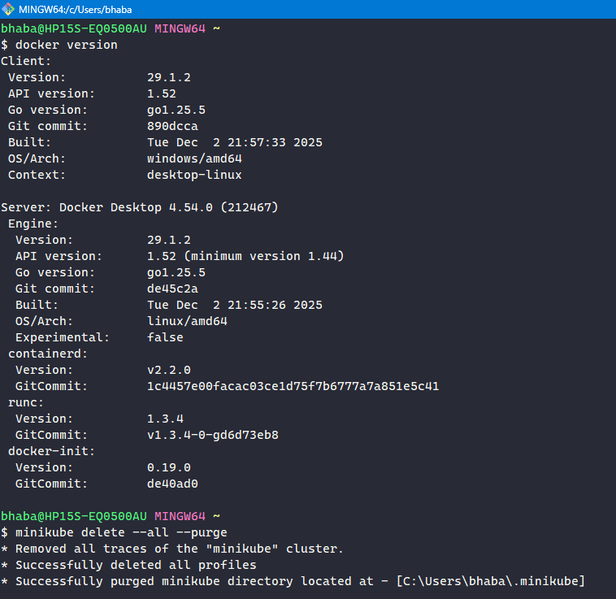
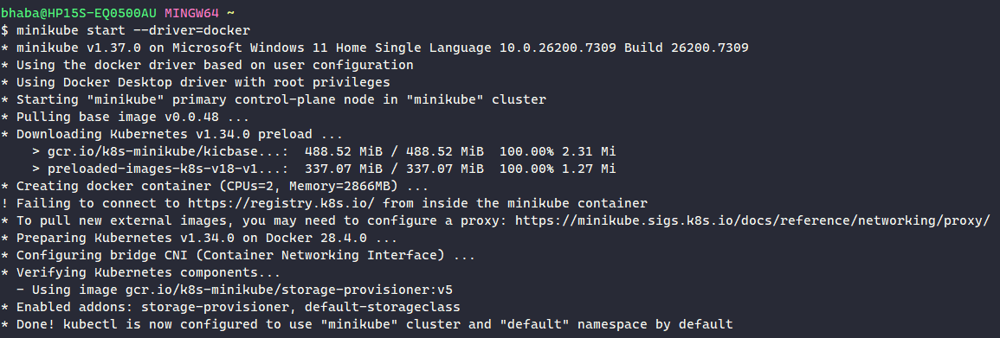
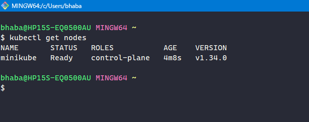

# 🚀 Minikube Setup for Testing

---

Minikube allows you to run a lightweight, single-node Kubernetes cluster locally. It is ideal for development, testing, and learning Kubernetes without needing a cloud environment.

---

### 🧰 1️⃣ Install Chocolatey

If Chocolatey is not already installed, follow the installation instructions from:
[https://chocolatey.org/install](https://chocolatey.org/install)

---

### 🧱 2️⃣ Install Minikube & kubectl

```bash
choco install minikube kubernetes-cli -y
```



---

### 🔍 3️⃣ Verify Minikube Installation

```bash
minikube version
```



---

### ▶️ 4️⃣ Start Minikube

```bash
minikube start
```

---

### ❌ ISSUE 1: Minikube Start Error



### Cause

Minikube is unsure which driver to use due to conflicting virtualization backends:

| Driver         | Status        | Problem                              |
| -------------- | ------------- | ------------------------------------ |
| **hyperv**     | auto-selected | Hyper-V PowerShell module missing    |
| **virtualbox** | fallback      | VT-x/AMD-V blocked (Hyper-V enabled) |
| **docker**     | ideal choice  | Docker Desktop not installed         |

---

### Attempt 1: Fix using virtualbox

Tried disabling Hyper-V and installing VirtualBox, but VT-x/AMD-V was still blocked.

turned off windows features for Hyper-V, rebooted, installed VirtualBox, but still faced the same issue.





---

### ✅ FIX: Explicitly Use Docker Driver

### Step 1: Install Docker Desktop

```bash
choco install docker-desktop -y
```

Reboot after installation.

---

### Step 2: Set Docker as Default Driver

```bash
minikube config set driver docker
```

---

### Step 3: Reset Minikube

```bash
minikube delete --all --purge
```



---

### Step 4: Start Minikube Using Docker

```bash
minikube start --driver=docker
```



---

### Step 5: Verify Cluster Status

```bash
kubectl get nodes
```



---
